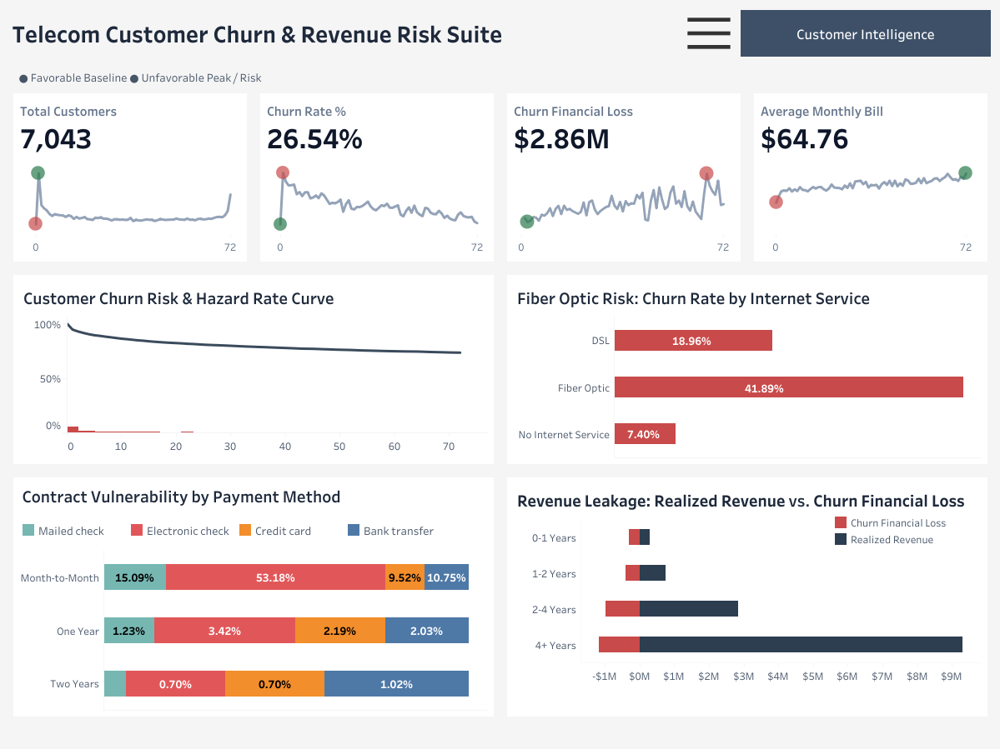
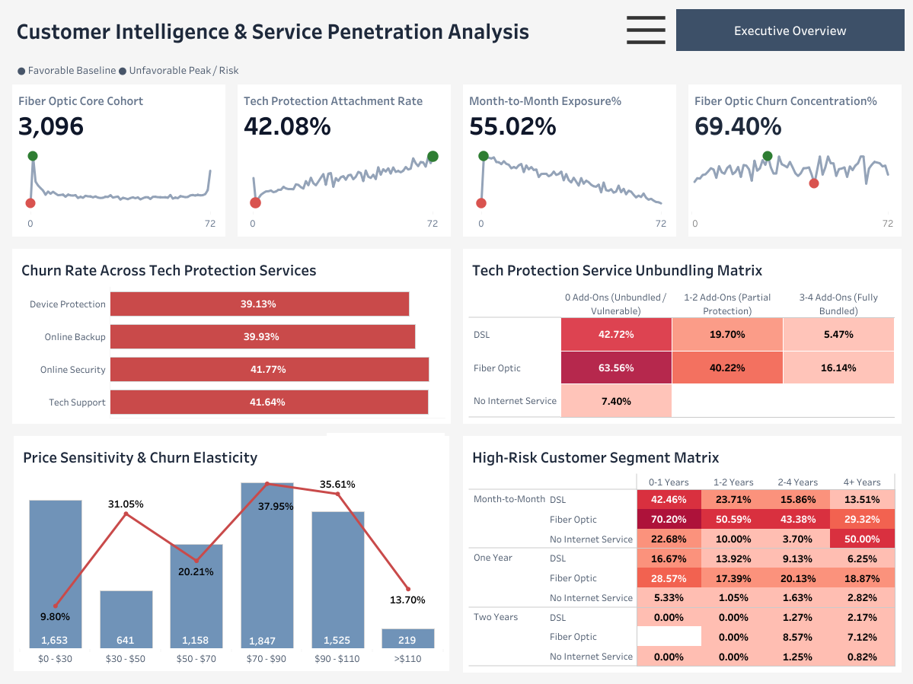

# 📊 Telecom Customer Churn & Revenue Risk Analysis

> **An Interactive Two-Page Tableau Suite & Python Data Pipeline**  

[](https://public.tableau.com/app/profile/meenakshi.singh1303/viz/Telco_Churn_Portfolio_Draft/1_Executive_Overview)
[](scripts/data_cleaning.py)

---

## 📌 Executive Summary

This project delivers an end-to-end analytical solution designed to identify key drivers of customer attrition and quantify revenue leakage for a major telecommunications provider. Utilizing Python for data preprocessing and Tableau for interactive business intelligence, this two-page dashboard suite translates **7,043 customer profiles** into actionable executive retention strategies.

### 🎯 Key Business Findings
* **Financial Exposure:** Overall churn sits at **26.54%**, accounting for **$2.86M in total financial loss**.
* **High-Risk Segment:** Month-to-Month Fiber Optic subscribers exhibit the highest vulnerability, reaching a churn concentration of **69.40%**.
* **Service Protection Gap:** Customers with **0 Tech Protection add-ons** experience a **63.56% churn rate** on Fiber Optic lines, compared to just **16.14%** for fully bundled users.
* **Pricing Threshold Elasticity:** Churn peaks significantly in the **$70–$90/month billing tier** (**37.95% churn rate**), indicating high price sensitivity among unbundled accounts.

---

## 🖼️ Dashboard Previews

### Page 1: Executive Overview
*High-level revenue risk tracking, hazard rate curves, contract vulnerability, and realized vs. lost revenue ratios.*

<details>
<summary><b>🔍 Click here to view Executive Overview Dashboard</b></summary>
<br>



</details>

---

### Page 2: Customer Intelligence & Service Penetration
*Granular breakdown of Fiber Optic cohorts, tech protection unbundling matrices, price sensitivity elasticity, and high-risk segment heatmaps.*

<details>
<summary><b>🔍 Click here to view Customer Intelligence Dashboard</b></summary>
<br>



</details>

---

## 🏗️ Data Architecture & Pipeline

```text
├── assets/                          # High-resolution dashboard screenshots
│   ├── 1_Executive_Overview.png
│   └── 2_Customer_Intelligence.png
├── data/                            # Raw and transformed dataset files
│   ├── raw/
│   │   └── WA_Fn-UseC_-Telco-Customer-Churn.csv
│   └── processed/
│       └── Clean_Telco_Customer_Churn.csv
├── docs/                            # Executive PDF documentation
│   └── Telco_Churn_Portfolio_Draft.pdf
├── scripts/                             # Data cleaning & feature engineering scripts
│   └── data_cleaning.py
├── Telco_Churn_Portfolio_Draft.twbx # Packaged Tableau Workbook file
└── README.md                        # Project documentation
